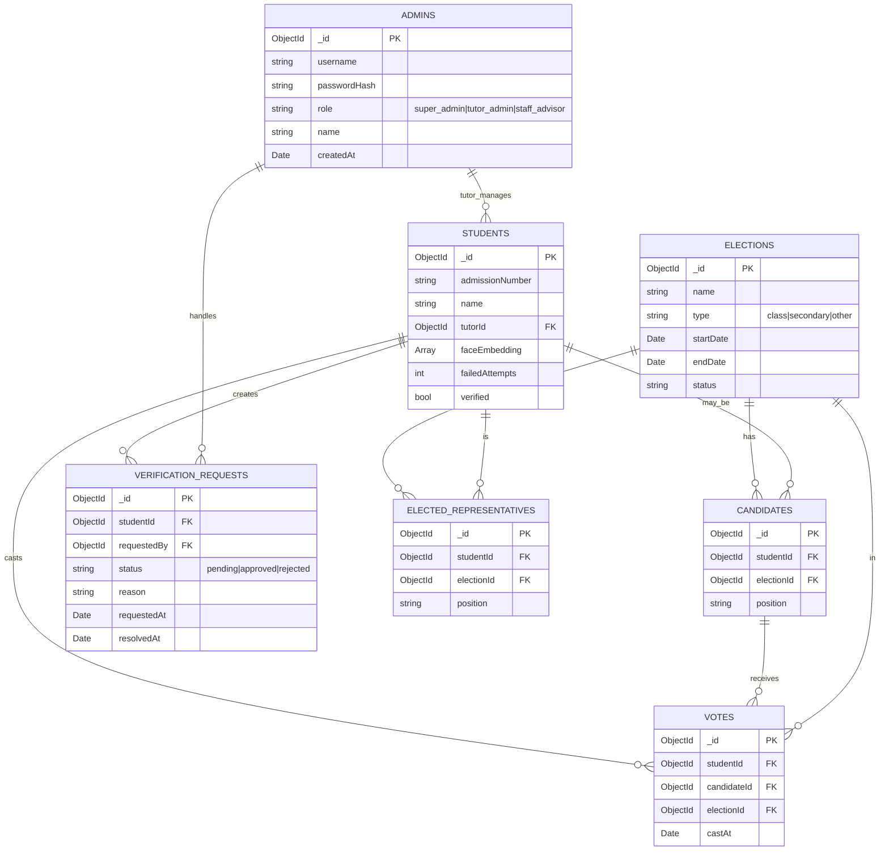

# Entity-Relationship Diagram

Below is a Mermaid ER diagram representing the main entities and relationships for this Voting Management System.

Notes:
- The ER diagram models `VOTES` as individual vote records linking a `STUDENT` to a `CANDIDATE` in an `ELECTION` (one record per selected candidate). This supports the "up to 2 candidates per election" rule by limiting cast operations per `studentId` + `electionId`.
- `faceEmbedding` stores the numeric embedding array (no raw images).

If you want a PNG/SVG export of this diagram or changes to attributes/relations, I can generate or refine it next.
